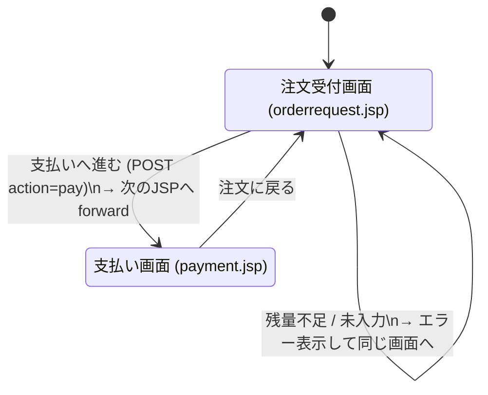
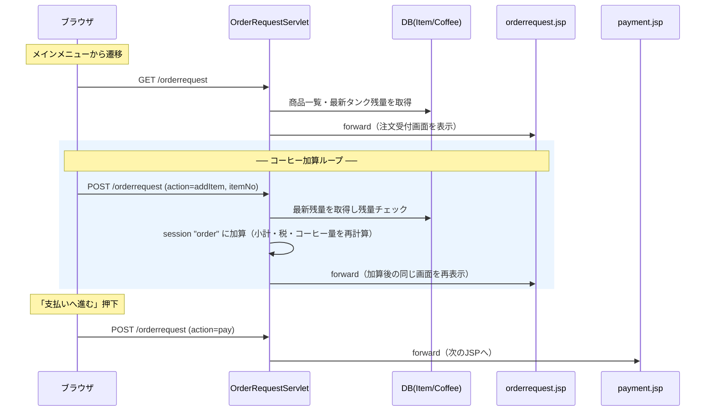

# 注文受付の画面遷移（コーヒー加算ループ → 支払い）

注文受付画面で「コーヒーボタン押下＝サーブレット経由で加算し同じJSPへ戻る」「支払いへ進む＝次のJSPへ遷移」を表した図です。
ファイルB（コミュニケーション図サンプル）スライド6の設計に対応し、実装サンプルは `../samples/order-acceptance/` にあります。

## 画面遷移（状態遷移図）

## リクエスト〜画面の流れ（シーケンス）

## 遷移仕様

| 操作 | HTTP | action | サーブレット処理 | 遷移先 |
|------|------|--------|------------------|--------|
| 画面初期表示 | GET | — | 商品一覧・残量取得 | orderrequest.jsp |
| コーヒー押下 | POST | `addItem` | 残量チェック→`order`へ加算（超過時はエラー） | orderrequest.jsp（**自己遷移/forward**） |
| 支払いへ進む | POST | `pay` | 注文が空でなければ遷移 | payment.jsp（**次画面/forward**） |

## 実装メモ
- 加算ループは **forward**（`order` はセッション保持なので `invalidate` しない＝forwardで問題なし）。
- ただし forward はURL不変のため**リロードで二重加算**の恐れ。嫌う場合は **PRG（加算後 redirect → GET表示）** にする。
- 残量は**毎回DBの最新値**（`SELECT currentCapacity FROM Coffee WHERE updateNo=(SELECT MAX(updateNo) FROM Coffee)`）を参照。
- 売上・コーヒー残量の**DB登録は支払い確定時**にまとめて行う（注文中はセッションに保持）。

実装コードは `../samples/order-acceptance/`（`OrderRequestServlet` / `orderrequest.jsp` / `payment.jsp` / `Order` 他）。
