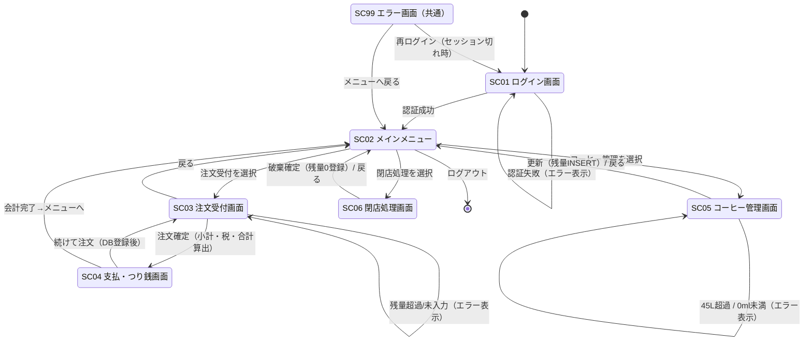
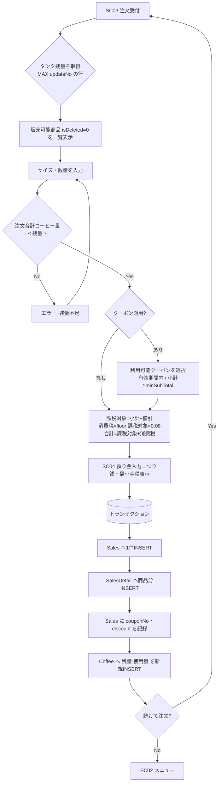

# 画面遷移図（たたき台） — はるみコーヒー販売支援システム ver1.0

> Mermaid記法で記述しています。GitHub上ではそのまま図として表示されます。
> 最終成果物としてはPowerPoint（`画面遷移図&レイアウト.pptx`）で作図し、画像化してWordに貼り付ける運用です（Q&A項番39）。本ファイルは設計検討用のたたき台です。

## 全体遷移

## 遷移番号一覧（画面連係図用）

| 遷移No | From | To | 契機・操作 | 条件/処理 |
|--------|------|----|-----------|-----------|
| 1.1 | SC01 | SC02 | ログインボタン | ID/PW がDBと一致（isRetire=0） |
| 1.2 | SC01 | SC01 | ログインボタン | 未登録/不一致 → エラー表示 |
| 2.1 | SC02 | SC03 | 「注文受付」 | — |
| 2.2 | SC02 | SC05 | 「コーヒー管理」 | — |
| 2.3 | SC02 | SC06 | 「閉店処理」 | — |
| 2.4 | SC02 | (終了) | 「ログアウト」 | セッション破棄 |
| 3.1 | SC03 | SC04 | 「注文確定」 | 注文量 ≤ タンク残量 |
| 3.2 | SC03 | SC03 | 「注文確定」 | 注文量 > 残量 → エラー |
| 3.3 | SC03 | SC02 | 「戻る」 | — |
| 4.1 | SC04 | SC03 | 「続けて注文」 | 売上・売上明細・コーヒー残量をDB登録後、SC03へ（連続注文） |
| 4.2 | SC04 | SC02 | 「会計完了」 | DB登録後、メニューへ |
| 5.1 | SC05 | SC02 | 「更新」/「戻る」 | 追加/削減量をCoffeeへ新規行INSERT |
| 5.2 | SC05 | SC05 | 「更新」 | 残量>45L or <0ml → エラー |
| 6.1 | SC06 | SC02 | 「破棄確定」 | 残量0の行をCoffeeへINSERT（確認後） |

## 注文受付〜会計の処理フロー（補足）

> 注：消費税は **8%・小数切り捨て**（Q&A項番1,2）。Item.price は税抜単価、Sales.total = subTotal + tax の外税モデルで扱う。
>
> クーポン適用時は **課税前値引き**：`課税対象 = subTotal − discount` → `tax = floor(課税対象 × 0.08)` → `total = 課税対象 + tax`。
> 1注文1枚・定額・注文単位。`subTotal` は値引き前グロスのまま保持し、`discount` を別列で記録する（閉店処理の集計整合のため）。詳細は `db/03_coupon.sql` / `db/README.md` を参照。
